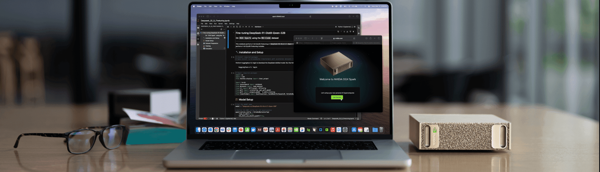

<p align="center">
  
</p>

# DGX Spark Playbooks

Collection of step-by-step playbooks for setting up AI/ML workloads on NVIDIA DGX Spark devices with Blackwell architecture.

## About

These playbooks provide detailed instructions for:
- Installing and configuring popular AI frameworks
- Running inference with optimized models
- Setting up development environments
- Connecting and managing your DGX Spark device

Each playbook includes prerequisites, step-by-step instructions, troubleshooting guidance, and example code.

## Use as Claude Code Skills

Every playbook in this repo is also exposed as a [Claude Code](https://docs.claude.com/claude-code) skill, so Claude can install and configure them for you interactively. An index skill (`dgx-spark`) routes broad questions to the right specific playbook, and each leaf skill carries cross-references to related playbooks (prerequisites, alternatives, what to try next).

### Option A: install via Claude Code plugin marketplace (recommended)

In Claude Code, run:

```
/plugin marketplace add jkneen/dgx-spark-playbooks
/plugin install dgx-spark-playbooks@dgx-spark-playbooks
```

### Option B: install locally via script

Clone and run the install script. This symlinks each skill into `~/.claude/skills/`, so `git pull` updates them in place.

```bash
git clone https://github.com/jkneen/dgx-spark-playbooks
cd dgx-spark-playbooks
./scripts/install.sh                  # individual skills → ~/.claude/skills/
./scripts/install.sh --plugin         # or: whole repo as a plugin → ~/.claude/plugins/
./scripts/uninstall.sh                # remove
```

Requires Node 18+ if you want to regenerate skills from overrides; otherwise the committed `skills/` directory is used as-is.

### Customizing a skill

Hand-curate any skill by creating or editing `overrides/<playbook-name>.md` (see [`overrides/ollama.md`](overrides/ollama.md) as a worked example), then run `node scripts/generate.mjs` to rebuild. Overrides contribute the frontmatter `description` (which controls when the skill triggers) and any extra sections like "Related skills" or gotchas. Generated content between `<!-- GENERATED:BEGIN -->` and `<!-- GENERATED:END -->` markers is rewritten from the upstream README on every regeneration; override content outside those markers is preserved.

A GitHub Action auto-regenerates `skills/` whenever a playbook README or override changes.

## Available Playbooks

### NVIDIA

- [Comfy UI](nvidia/comfy-ui/)
- [Connect Three DGX Spark in a Ring Topology](nvidia/connect-three-sparks/)
- [Set Up Local Network Access](nvidia/connect-to-your-spark/)
- [Connect Two Sparks](nvidia/connect-two-sparks/)
- [CUDA-X Data Science](nvidia/cuda-x-data-science/)
- [DGX Dashboard](nvidia/dgx-dashboard/)
- [FLUX.1 Dreambooth LoRA Fine-tuning](nvidia/flux-finetuning/)
- [Run Hermes Agent with Local Models](nvidia/hermes-agent/)
- [Install and Use Isaac Sim and Isaac Lab](nvidia/isaac/)
- [Optimized JAX](nvidia/jax/)
- [Live VLM WebUI](nvidia/live-vlm-webui/)
- [Run models with llama.cpp on DGX Spark](nvidia/llama-cpp/)
- [LLaMA Factory](nvidia/llama-factory/)
- [LM Studio on DGX Spark](nvidia/lm-studio/)
- [Build and Deploy a Multi-Agent Chatbot](nvidia/multi-agent-chatbot/)
- [Multi-modal Inference](nvidia/multi-modal-inference/)
- [Connect Multiple DGX Spark through a Switch](nvidia/multi-sparks-through-switch/)
- [NCCL for Two Sparks](nvidia/nccl/)
- [Fine-tune with NeMo](nvidia/nemo-fine-tune/)
- [NemoClaw with Nemotron 3 Super and Telegram on DGX Spark](nvidia/nemoclaw/)
- [Nemotron-3-Nano with llama.cpp](nvidia/nemotron/)
- [NIM on Spark](nvidia/nim-llm/)
- [NVFP4 Quantization](nvidia/nvfp4-quantization/)
- [Ollama](nvidia/ollama/)
- [Open WebUI with Ollama](nvidia/open-webui/)
- [OpenClaw 🦞](nvidia/openclaw/)
- [Secure Long Running AI Agents with OpenShell on DGX Spark](nvidia/openshell/)
- [Portfolio Optimization](nvidia/portfolio-optimization/)
- [Fine-tune with Pytorch](nvidia/pytorch-fine-tune/)
- [RAG Application in AI Workbench](nvidia/rag-ai-workbench/)
- [SGLang for Inference](nvidia/sglang/)
- [Single-cell RNA Sequencing](nvidia/single-cell/)
- [Spark & Reachy Photo Booth](nvidia/spark-reachy-photo-booth/)
- [Speculative Decoding](nvidia/speculative-decoding/)
- [Set up Tailscale on Your Spark](nvidia/tailscale/)
- [TRT LLM for Inference](nvidia/trt-llm/)
- [Text to Knowledge Graph on DGX Spark](nvidia/txt2kg/)
- [Unsloth on DGX Spark](nvidia/unsloth/)
- [Vibe Coding in VS Code](nvidia/vibe-coding/)
- [vLLM for Inference](nvidia/vllm/)
- [VS Code](nvidia/vscode/)
- [Build a Video Search and Summarization (VSS) Agent](nvidia/vss/)

## Resources

- **Documentation**: https://www.nvidia.com/en-us/products/workstations/dgx-spark/
- **Developer Forum**: https://forums.developer.nvidia.com/c/accelerated-computing/dgx-spark-gb10
- **Terms of Service**: https://assets.ngc.nvidia.com/products/api-catalog/legal/NVIDIA%20API%20Trial%20Terms%20of%20Service.pdf

## License

See:
- [LICENSE](LICENSE) for licensing information.
- [LICENSE-3rd-party](LICENSE-3rd-party) for third-party licensing information.