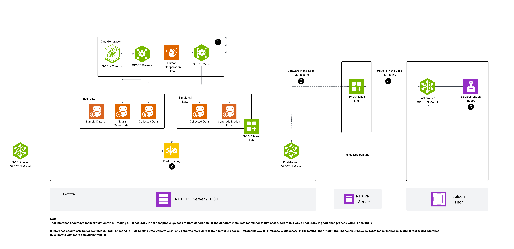

# Fine-Tune Isaac GR00T for Robot Skills

> A vision-language-action policy adapted on LIBERO Spatial

## Table of Contents

- [Overview](#overview)
- [Instructions](#instructions)
  - [1a. Git LFS (required for a clean clone)](#1a-git-lfs-required-for-a-clean-clone)
  - [1b. Clone and check out `n1.6-release`](#1b-clone-and-check-out-n16-release)
  - [1c. Install Python dependencies](#1c-install-python-dependencies)
- [Troubleshooting](#troubleshooting)
  - [Manual torchcodec build (optional)](#manual-torchcodec-build-optional)

---

## Overview

## Basic idea

NVIDIA Isaac GR00T N1.6 is a 3-billion-parameter open vision-language-action (VLA) foundation model for generalist humanoid robot skills. It combines a Cosmos-family vision-language backbone with a 32-layer Diffusion Transformer (DiT) action head that denoises continuous robot actions from multimodal input — language instructions and camera images. The model is pre-trained on a large mixture of robot demonstration data, then adapted to specific embodiments and tasks through fine-tuning.

High-level architecture (VLM + DiT action head), as in the upstream Isaac GR00T repo:



*Source: [NVIDIA Isaac GR00T — `media/GR00T-reference-arch-diagram.png`](https://github.com/NVIDIA/Isaac-GR00T/blob/n1.6-release/media/GR00T-reference-arch-diagram.png). If the local image above is missing, the upstream copy is at `https://raw.githubusercontent.com/NVIDIA/Isaac-GR00T/n1.6-release/media/GR00T-reference-arch-diagram.png`.*

In this playbook you fine-tune GR00T N1.6 on the **LIBERO Spatial** benchmark on your **hardware platform**. Large unified GPU memory supports a high **global batch size (128)** on a single GPU, which improves training throughput compared with typical 24–80 GB cards.

## LIBERO Spatial (what you are fine-tuning on)

**LIBERO Spatial** is part of the [LIBERO](https://libero-project.github.io/main.html) suite of simulated tabletop manipulation benchmarks. The **spatial** split emphasizes **where** objects need to be placed: tasks such as putting a bowl on a **stove burner** vs a **plate**, placing utensils in a **mug** vs next to it, or moving objects to **left/right/front** targets on the table. Episodes include third-person RGB video, proprioceptive state, language instructions, and continuous end-effector actions in a consistent LeRobot v2 layout. Understanding these constraints helps when you read training logs or open-loop evaluation plots.

## What kind of fine-tuning this playbook uses

This playbook runs the **default Isaac GR00T fine-tuning recipe** from `launch_finetune.py`: **not** full-model weight updates of the entire 3B VLM. In the stock configuration, training focuses on the **action head (DiT)** and **projector / adapter paths** that map observations into the action model, with strong **state dropout** and **color jitter** so the policy leans on vision. Optional flags such as `--tune-llm` or `--tune-visual` (mentioned under Next steps) trade compute and memory for updating more of the backbone. **LoRA** is not the default here; if your team uses LoRA or other PEFT variants, treat that as a separate configuration branch from this playbook.

## What you'll accomplish

You'll fine-tune and evaluate Isaac GR00T N1.6 on your **hardware platform**:

- Check out the **`n1.6-release`** branch of Isaac GR00T so commands, embodiment tags, and `demo_data/` match GR00T **N1.6**
- Set up the environment with `uv` (project-local `.venv`) and understand what the optional `install_deps.sh` script changes on the system
- Apply the recommended **PyAV `get_frames_by_indices` patch** when `torchcodec` is unavailable so LIBERO **AV1** video decoding does not stall on an **ffmpeg** subprocess fallback
- Verify the base model, fine-tune on LIBERO Spatial at batch size **128**, run open-loop evaluation, and measure inference latency

## What to know before starting

**Required:**

- Familiarity with Python virtual environments (`source .venv/bin/activate`)
- Familiarity with PyTorch training concepts (batch size, loss, checkpoints)
- Comfort running commands that may use **`sudo`** for system packages (or use the documented user-space alternative)

**Optional:**

- Basic robot manipulation vocabulary (trajectories, observations, actions)

## Supported hardware platforms

Use the matrix below to confirm your hardware platform, recommended default local settings, and whether multi-node applies.

| Hardware platform | OS | Memory | Recommended default local settings | Multi-node capable hardware |
| :---- | :---- | :---- | :---- | :---- |
| **DGX Station** | DGX OS (Linux) | ~284 GB HBM3e (GB300) | Isaac GR00T `n1.6-release`; `uv` + PyAV patch; global batch size **128** | — |

## Prerequisites

**Hardware requirements**

- Supported hardware platform — see Supported hardware platforms matrix above
- At least **~30 GB** free disk for `.venv`, checkpoints, and the LIBERO download

**Software requirements**

- CUDA toolkit usable by PyTorch: `nvcc --version` should show **CUDA 12.8+** (often already under `/usr/local/cuda`)
- **Git** and **Git LFS** (`git lfs version`) — LFS is required for some demo assets and submodules; install with `sudo apt-get install -y git-lfs` then `git lfs install` if missing
- Hugging Face account and **HF_TOKEN** for model and dataset downloads
- Network access to Hugging Face, GitHub, and PyPI

## Ancillary files

All required assets can be found [in this playbook repository](https://github.com/NVIDIA/dgx-spark-playbooks/blob/main/nvidia/playbook-gr00t/).

- `assets/GR00T-reference-arch-diagram.png` — Architecture diagram shown above
- `assets/patches/001-pyav-get-frames-by-indices.patch` — PyAV indexed-frame reader for LIBERO video
- `assets/patches/README.md` — When and how to apply the patch
- `assets/patches/video_utils_*.py` — Reference snippets for the patched `video_utils` path

## Time & risk

- **Estimated time:** 45 MIN end-to-end when the video backend is healthy (setup, downloads, ~20–25 min training at 2000 steps, eval and inference). With the PyAV fallback and no `torchcodec`, full 2000-step training can take several hours — see Instructions.
- **Risk level:** Medium
  - `scripts/deployment/dgpu/install_deps.sh` performs **system-level** `apt` operations and may install the **CUDA 12.8 toolkit** if `/usr/local/cuda` is absent
  - Model and dataset downloads require Hugging Face authentication
  - Video decoding fallbacks can stall training if the PyAV patch is skipped
- **Rollback:** Remove the cloned `Isaac-GR00T` directory and optionally `rm -rf ~/.local/share/uv` if you want to reclaim `uv` caches. Reverting `apt`-installed packages is a separate admin task; the playbook does not uninstall them automatically.
- **Last Updated:** 08/03/2026
  - Fine-tune Isaac GR00T N1.6 on LIBERO Spatial with setup, PyAV video patch, evaluation, and inference steps on supported hardware platforms

## Instructions

## Step 1. Clone Isaac GR00T and install dependencies

### 1a. Git LFS (required for a clean clone)

If `git clone` fails with errors about **Git LFS** or missing pointer files, install and initialize LFS, then remove any partial `Isaac-GR00T` directory and clone again:

```bash
sudo apt-get update
sudo apt-get install -y git-lfs
git lfs install
```

### 1b. Clone and check out `n1.6-release`

The **`main`** branch tracks ongoing development (for example newer GR00T milestones) and **does not** always match this **N1.6** playbook. Embodiment tags such as **`GR1`**, paths like **`demo_data/gr1.PickNPlace`**, and tutorial scripts are aligned with the **`n1.6-release`** branch.

```bash
git clone --recurse-submodules https://github.com/NVIDIA/Isaac-GR00T
cd Isaac-GR00T
git fetch origin
git checkout n1.6-release
git submodule update --init --recursive
```

### 1c. Install Python dependencies

#### Option A — `install_deps.sh` (matches upstream docs; uses `sudo`)

This script is the supported path. It may make **system-level** changes:

- Runs `apt-get update` and installs **`ffmpeg`** and **`libaio-dev`**
- If **`/usr/local/cuda`** is missing, adds the NVIDIA CUDA apt repository and installs **`cuda-toolkit-12-8`**
- Installs **`uv`** into your user account if needed, then runs **`uv sync`** and **`uv pip install -e .`** into the project **`.venv`**
- On **aarch64** only: installs FFmpeg **development** packages and **builds `torchcodec` from source** into `.venv`

```bash
I_CONFIRM_THIS_IS_NOT_A_LICENSE_VIOLATION=1 bash scripts/deployment/dgpu/install_deps.sh
```

#### Option B — User-space only (no `install_deps.sh`)

Use this only when **CUDA 12.8+** is already installed, system **`ffmpeg`** / **`libaio-dev`** are already present, and your policy forbids the script's `apt` or CUDA steps. From the **Isaac-GR00T** repo root, install **`uv`** if needed, then:

```bash
command -v uv >/dev/null || curl -LsSf https://astral.sh/uv/install.sh | sh
export PATH="/usr/local/cuda/bin:$HOME/.local/bin:$PATH"
export CUDA_HOME=/usr/local/cuda
uv sync
uv pip install -e .
```

You still need a working **video backend** for LIBERO (see Step 2). On aarch64, building **torchcodec** inside `.venv` without the script is possible but manual; see Troubleshooting.

> [!IMPORTANT]
> **`PATH` and `CUDA_HOME` matter on multi-toolkit hosts.** If the system has both an old Ubuntu `nvidia-cuda-toolkit` package (`/usr/bin/nvcc` ≈ 12.0) and a current NVIDIA CUDA repo install (`/usr/local/cuda-13.x/bin/nvcc`), `uv` will pick whichever appears first on `PATH`. Putting `/usr/local/cuda/bin` first (and exporting `CUDA_HOME`) is required for `flash-attn`'s source build to find the matching toolkit. Verify with `nvcc --version` after the export.

> [!WARNING]
> **`flash-attn` build on aarch64 takes ~2 hours from source.** The upstream `pyproject.toml` only lists pre-built `flash-attn==2.7.4.post1` wheels for **`x86_64`**; on aarch64, `uv sync` falls back to compiling ~72 CUDA kernels from source. A faster route is to pin `flash-attn==2.8.1` and reuse the GitHub release's prebuilt aarch64 wheel:
>
> ```toml
> # In pyproject.toml under [project] dependencies.
> # The wheel below is built against torch 2.10 (see "torch2.10" in its filename), but upstream
> # n1.6-release pins torch==2.7.1 — you MUST bump torch and its companions to match, otherwise
> # `import flash_attn` fails at runtime with an undefined-symbol (C++ ABI) error and the pipeline
> # dies at Step 5 (base-model load):
> "torch==2.10.0",          # was 2.7.1
> "torchvision==0.25.0",    # pairs with torch 2.10
> "triton==3.6.0",          # torch 2.10.0 requires triton 3.6.0
> "flash-attn==2.8.1",
>
> # In [tool.uv.sources]:
> flash-attn = [
>     { url = "https://github.com/Dao-AILab/flash-attention/releases/download/v2.8.1/flash_attn-2.8.1+cu12torch2.10cxx11abiTRUE-cp312-cp312-linux_aarch64.whl",
>       marker = "sys_platform == 'linux' and platform_machine == 'aarch64' and python_version == '3.12'" },
> ]
> ```
>
> With this pin, `uv sync` finishes in ~1 minute on aarch64 instead of ~2 hours. The torch/torchvision/triton bump is **required**, not optional — the wheel will not import against the upstream 2.7.1 pin. This matches the torch 2.10 stack this playbook validates at Step 8.

Activate the virtual environment:

```bash
source .venv/bin/activate
```

Verify GPU access:

```bash
CUDA_VISIBLE_DEVICES=0 python -c "import torch; print(torch.cuda.get_device_name(0))"
```

Expected output: `NVIDIA GB300`

> [!NOTE]
> Examples in this playbook use **`CUDA_VISIBLE_DEVICES=0`** because the primary training GPU is at index `0` on a single-GPU hardware platform. On a multi-GPU hardware platform, run `nvidia-smi --query-gpu=index,name --format=csv,noheader`, find the large-memory GPU row, and substitute that index everywhere `CUDA_VISIBLE_DEVICES=0` appears below.

## Step 2. PyAV patch for LIBERO video (strongly recommended)

On many stacks **`torchcodec`** fails to import or build, the resolver falls back to **`pyav`**, and stock **`n1.6-release`** can raise **`NotImplementedError`** from `get_frames_by_indices` for the **`pyav`** backend (fallback order is already `torchcodec` → `decord` → `pyav` → `ffmpeg`). Without this patch, training may **appear hung**: GPU idle, no traceback, while **ffmpeg** spawns per-frame decode work on the CPU.

From the **Isaac-GR00T repo root** with **`n1.6-release`** checked out and **`.venv` activated**:

The patch ships with **this playbook**, not with the Isaac-GR00T clone, so fetch it first:

```bash
## Fetch the playbook (contains the patch) somewhere outside your Isaac-GR00T clone:
git clone https://github.com/NVIDIA/dgx-spark-playbooks /tmp/client-hardware-playbooks

## From the Isaac-GR00T repo root (n1.6-release checked out, .venv active):
git apply /tmp/client-hardware-playbooks/nvidia/playbook-gr00t/assets/patches/001-pyav-get-frames-by-indices.patch
uv pip install av
```

> Already have this playbook checked out (or its assets bundle)? Use that path instead of the clone above. See [`assets/patches/README.md`](assets/patches/README.md) for the copy-into-clone alternative.

If you copied `nvidia/playbook-gr00t/assets/patches/` into the Isaac-GR00T root instead, use `git apply assets/patches/001-pyav-get-frames-by-indices.patch`.

Details and re-apply rules: [`assets/patches/README.md`](assets/patches/README.md).

After patching, repeated log lines such as `Video backend 'torchcodec' is not available, falling back to 'pyav'` are **expected** and noisy but not fatal.

## Step 3. Set up Hugging Face authentication

```bash
export HF_TOKEN="your_huggingface_token"
```

Get a token from https://huggingface.co/settings/tokens if you don't have one.

## Step 4. Download the dataset and model

Download the LIBERO Spatial dataset and the GR00T N1.6 base model:

```bash
## Download LIBERO Spatial dataset (~2-3 GB)
huggingface-cli download \
    --repo-type dataset IPEC-COMMUNITY/libero_spatial_no_noops_1.0.0_lerobot \
    --local-dir examples/LIBERO/libero_spatial_no_noops_1.0.0_lerobot/

## Copy the LIBERO modality config into the dataset's meta/ directory
cp examples/LIBERO/modality.json \
    examples/LIBERO/libero_spatial_no_noops_1.0.0_lerobot/meta/

## Download GR00T N1.6 base model (~6 GB)
huggingface-cli download nvidia/GR00T-N1.6-3B
```

> [!NOTE]
> **HF cache permission errors:** If `huggingface-cli download` fails with `Permission denied: '/home/.../.cache/huggingface/hub/...'`, the cache directory was previously created by a Docker container running as root (common on shared machines). Point HF at a user-owned cache for this run:
>
> ```bash
> export HF_HOME=$HOME/hf_cache_gr00t
> ```
>
> **Transient `xet-read-token` 500 errors:** Hugging Face's xet backend occasionally returns `500 Internal Server Error` for dataset downloads. Disable it:
>
> ```bash
> export HF_HUB_DISABLE_XET=1
> ```

Verify the dataset is ready:

```bash
ls examples/LIBERO/libero_spatial_no_noops_1.0.0_lerobot/meta/modality.json
```

**Expected result:** the command prints the full path to **`modality.json`** (and `ls` exits 0). That confirms the merged modality file exists next to the downloaded LeRobot dataset metadata.

## Step 5. Verify the base model loads and runs

Confirm the GR00T N1.6 base model loads and produces actions using the **GR1** demo shipped on **`n1.6-release`**:

```bash
TORCHDYNAMO_DISABLE=1 CUDA_VISIBLE_DEVICES=0 python scripts/deployment/standalone_inference_script.py \
    --model-path nvidia/GR00T-N1.6-3B \
    --dataset-path demo_data/gr1.PickNPlace \
    --embodiment-tag GR1 \
    --traj-ids 0 \
    --inference-mode pytorch \
    --action-horizon 8 \
    --steps 32
```

**`TORCHDYNAMO_DISABLE=1`** avoids **`torch.compile`** / Triton paths that can fail on this hardware platform with **`ptxas-blackwell fatal: Value 'sm_103a' is not defined for option 'gpu-name'`**. Keep it on all **`standalone_inference_script.py`** invocations in this playbook unless you have a Triton build that supports SM103.

You should see per-step timing output and no errors. This confirms the model, CUDA, and data pipeline work before a long fine-tuning run.

> [!NOTE]
> The base model's pretrained processor does not include the **`LIBERO_PANDA`** embodiment configuration, so you cannot run this standalone script on the LIBERO dataset with the **base** checkpoint alone. The LIBERO modality config is registered during fine-tuning. That is expected — LIBERO is a post-training benchmark.

## Step 6. Fine-tune GR00T N1.6 on LIBERO Spatial

Fine-tune the base model on LIBERO Spatial. Large GPU memory on the supported hardware platform allows a global batch size of **128** — roughly several times what fits on a typical 80 GB GPU. Larger batches stabilize gradients and improve wall-clock throughput **when the dataloader keeps the GPU fed**.

```bash
CUDA_VISIBLE_DEVICES=0 python \
    gr00t/experiment/launch_finetune.py \
    --base-model-path nvidia/GR00T-N1.6-3B \
    --dataset-path examples/LIBERO/libero_spatial_no_noops_1.0.0_lerobot/ \
    --embodiment-tag LIBERO_PANDA \
    --num-gpus 1 \
    --output-dir output/libero_spatial_ft \
    --save-steps 500 \
    --save-total-limit 5 \
    --max-steps 2000 \
    --global-batch-size 128 \
    --learning-rate 1e-4 \
    --warmup-ratio 0.05 \
    --weight-decay 1e-5 \
    --state-dropout-prob 0.8 \
    --color-jitter-params brightness 0.3 contrast 0.4 saturation 0.5 hue 0.08 \
    --dataloader-num-workers 4
```

If GPU utilization stays **near zero** for many minutes while the process is alive, suspect **video decoding** (see Step 2 patch and Troubleshooting). You can try **`--dataloader-num-workers 8`** if CPU cores are available.

Training runs for **2000 steps** at batch size 128 and takes approximately **20–25 minutes** when **`torchcodec`** is the active video backend.

> [!IMPORTANT]
> **With the PyAV fallback (Step 2 patch + no torchcodec)**, expect ~5–6 s per step instead of <1 s — so 2000 steps is closer to **2.5–3 hours**, and GPU utilization sits in the 3–30 % range while CPU-side video decoding starves the GPU. To validate the workflow without the long wait, lower `--max-steps` (e.g. `100`) and `--save-steps` (e.g. `50`); loss should still drop visibly (validated drop **1.07 → 0.63** in 100 steps). If you need full-throughput training, build `torchcodec` from source (Troubleshooting → "Video decoding errors") or run **Option A** which builds it for you.

> [!NOTE]
> This playbook uses 2000 steps to keep execution time under an hour. For production-quality results closer to the published **97.65%** success rate on LIBERO Spatial, increase to **20,000 steps** (`--max-steps 20000`). Published settings used batch size **640** across **8** GPUs — 128 on one large-memory GPU exceeds the per-GPU batch in that reference.

**What the training flags mean:**

| Flag | Value | Purpose |
|------|-------|---------|
| `--global-batch-size` | 128 | Total samples per training step; enabled by large GPU memory. |
| `--state-dropout-prob` | 0.8 | Drops proprioceptive state 80% of the time so the model relies on vision. |
| `--color-jitter-params` | brightness/contrast/saturation/hue | Photometric augmentation for lighting robustness. |
| `--warmup-ratio` | 0.05 | Linear LR warmup over the first 5% of steps. |
| `--save-steps` | 500 | Checkpoint cadence under `output/libero_spatial_ft/`. |

Monitor the Hugging Face **Trainer** `loss` in the terminal. Checkpoints land under `output/libero_spatial_ft/`.

## Step 7. Evaluate the fine-tuned model

Open-loop evaluation compares predicted actions to dataset ground truth and writes plots to **`/tmp/open_loop_eval/`**:

```bash
CUDA_VISIBLE_DEVICES=0 python gr00t/eval/open_loop_eval.py \
    --dataset-path examples/LIBERO/libero_spatial_no_noops_1.0.0_lerobot/ \
    --embodiment-tag LIBERO_PANDA \
    --model-path output/libero_spatial_ft/checkpoint-2000/ \
    --traj-ids 0 1 2 \
    --action-horizon 16
```

**How to read the run:** the terminal prints **per-trajectory MSE/MAE** and **averages**. The JPEGs under **`/tmp/open_loop_eval/`** overlay **predicted** vs **ground-truth** trajectories per action dimension (translation, rotation, gripper). Use them to confirm the policy tracks pick-and-place phases and gripper open/close timing on spatial tasks.

> [!TIP]
> At 2000 steps you should see clear improvement over a random policy; at 20,000 steps, published LIBERO Spatial success reaches **97.65%** in closed-loop sim.

## Step 8. Run inference on a LIBERO sample (timing + actions)

This step passes **LIBERO Spatial** observations through the **fine-tuned** checkpoint (the base model cannot run this embodiment). **`TORCHDYNAMO_DISABLE=1`** is included for SM103 stability:

```bash
TORCHDYNAMO_DISABLE=1 CUDA_VISIBLE_DEVICES=0 python scripts/deployment/standalone_inference_script.py \
    --model-path output/libero_spatial_ft/checkpoint-2000/ \
    --dataset-path examples/LIBERO/libero_spatial_no_noops_1.0.0_lerobot/ \
    --embodiment-tag LIBERO_PANDA \
    --traj-ids 0 \
    --inference-mode pytorch \
    --action-horizon 8
```

**What to inspect:** the script prints a **detailed timing summary** — model-load and dataset-load times, then per-trajectory episode-loading, data-preparation, and inference timings, plus per-step inference statistics (avg / min / max / P90) — alongside the **MSE/MAE** of predicted vs. ground-truth actions. Compare these to Step 5's base-model smoke test. In eager mode (with `TORCHDYNAMO_DISABLE=1`), per-step latency depends heavily on the torch + CUDA stack — expect **~3–4 s/step** on torch 2.10 + cu130 in eager mode (validated on a fine-tuned `checkpoint-100`); a compiled torch 2.7 + cu128 stack with Triton support for `sm_103` can be much faster. Treat **average per-step inference latency** as the most stable signal across stacks.

## Step 9. Cleanup

Cleanup is optional rollback — not required to finish the playbook.

> [!WARNING]
> This removes the cloned repository and fine-tuned checkpoints under it. Copy checkpoints elsewhere first if you want to keep them.

```bash
deactivate
cd ..
rm -rf Isaac-GR00T
```

Fine-tuned checkpoints under `output/libero_spatial_ft/` are removed with the repo.

## Next steps

- **Increase training steps** — `--max-steps 20000` for stronger LIBERO Spatial alignment (~3.5 hours at the same throughput).
- **Other LIBERO suites** — `libero_10_no_noops`, `libero_goal_no_noops`, `libero_object_no_noops` from **IPEC-COMMUNITY** on Hugging Face.
- **Closed-loop sim** — LIBERO sim server/client: [LIBERO evaluation in Isaac GR00T](https://github.com/NVIDIA/Isaac-GR00T/blob/n1.6-release/examples/LIBERO/README.md#evaluate-checkpoint).
- **Custom embodiments** — [Fine-tune a new embodiment](https://github.com/NVIDIA/Isaac-GR00T/blob/n1.6-release/getting_started/finetune_new_embodiment.md) (LeRobot v2 + modality JSON).
- **Tune more of the stack** — `--tune-llm` / `--tune-visual` raise memory use; probe batch size if you enable them.

## Troubleshooting

| Symptom | Cause | Fix |
|---------|-------|-----|
| `git clone` fails or demo videos are tiny / missing | Git LFS not installed or not initialized | `sudo apt-get install -y git-lfs && git lfs install`; remove any partial `Isaac-GR00T` directory; clone again with `--recurse-submodules` |
| `GR1`, `demo_data/gr1.PickNPlace`, or scripts do not match the playbook | Wrong branch (for example `main` tracking a newer GR00T line) | `cd Isaac-GR00T && git fetch origin && git checkout n1.6-release && git submodule update --init --recursive` |
| `install_deps.sh` not allowed by policy | Script runs `sudo apt-get` (ffmpeg, libaio-dev, optional CUDA toolkit) and installs `uv` / syncs `.venv` | Pre-install the same system packages and CUDA via your IT process; then from the repo root: `export PATH="$HOME/.local/bin:$PATH" && uv sync && uv pip install -e .`. On aarch64 still need `torchcodec` or the PyAV patch (Instructions Step 2) |
| `uv sync` appears stuck for hours building `flash-attn` on aarch64 | Upstream lists prebuilt `flash-attn` wheels only for `linux_x86_64` | Pin `flash-attn==2.8.1` plus matching torch 2.10 / torchvision / triton, and add the aarch64 wheel URL under `[tool.uv.sources]` (see Instructions Step 1c Warning) |
| `install_deps.sh` fails building torchcodec | Missing license confirmation or FFmpeg development libraries | Set `I_CONFIRM_THIS_IS_NOT_A_LICENSE_VIOLATION=1` and re-run; if needed install FFmpeg dev packages (`libav*-dev`, `pkg-config`, `cmake`, `build-essential`, `pybind11-dev`) then apply Instructions Step 2 |
| `huggingface-cli download` fails with 401 Unauthorized | Missing or invalid `HF_TOKEN`, or gated-model agreement not accepted | `echo $HF_TOKEN && huggingface-cli whoami`; export a valid token; accept required agreements on the model page |
| `Permission denied` under `~/.cache/huggingface/hub/...` | Cache directory owned by root (common after Docker runs) | `export HF_HOME=$HOME/hf_cache_gr00t && mkdir -p "$HF_HOME"`; re-export for later steps |
| `500 Internal Server Error` from `xet-read-token` | Transient Hugging Face xet backend failure | `export HF_HUB_DISABLE_XET=1` and retry the download |
| `externally-managed-environment` or packages missing from `.venv` | PEP 668 / installs not targeting the project venv | `source .venv/bin/activate`; use `uv pip install ...` (never `sudo pip`); recreate `.venv` with `uv sync` if needed |
| CUDA out of memory during fine-tuning | Batch size or `--tune-llm` / `--tune-visual` exceeds free GPU memory | Lower `--global-batch-size` (for example `64`); check `nvidia-smi` for other GPU processes |
| `ptxas-blackwell fatal: Value 'sm_103a' is not defined for option 'gpu-name'` | Triton / `torch.compile` path lacks SM103 support | Prefix inference with `TORCHDYNAMO_DISABLE=1` (see Instructions Steps 5 and 8); use the same prefix for eval only if you see the same crash |
| `ModuleNotFoundError: No module named 'gr00t'` | Virtualenv not activated or wrong working directory | `source .venv/bin/activate` from the Isaac-GR00T repo root |
| `NotImplementedError` in `get_frames_by_indices` when backend is `pyav` | Stock `n1.6-release` lacks the `pyav` indexed-frame branch | Apply the playbook PyAV patch and `uv pip install av` (Instructions Step 2; `assets/patches/README.md`) |
| Training “hangs” — low GPU utilization, no traceback, very slow steps | Fallback to per-frame `ffmpeg` subprocess decoding for AV1 LIBERO clips | Apply the PyAV patch + `uv pip install av`; optionally raise `--dataloader-num-workers` (for example `8`) |
| Video decoding errors / `torchcodec` not found | Preferred video backend missing or build failed | Prefer PyAV patch + `av`; to build torchcodec manually into `.venv` see detailed notes below |
| Training loss is not decreasing | Early run, wrong modality, or LR too low for a short smoke test | Verify `meta/modality.json`, confirm `--embodiment-tag LIBERO_PANDA`, try `--learning-rate 5e-4` on short runs |
| `nvidia-smi` shows the wrong GPU | Multi-GPU host; `CUDA_VISIBLE_DEVICES` points at a secondary card | `nvidia-smi --query-gpu=index,name --format=csv,noheader` then set `CUDA_VISIBLE_DEVICES=<index>` |
| OpenCV or decord cannot decode LIBERO AV1 | OpenCV often fails on AV1; decord may lack a compatible wheel | Use the PyAV patch path documented in this playbook |

### Manual torchcodec build (optional)

Prefer the **PyAV patch + `av`** path for LIBERO. If you must build **torchcodec** into `.venv` manually (aarch64), with FFmpeg development packages installed:

```bash
## Run this from inside the Isaac-GR00T repo root (the directory that
## contains .venv). Capture its absolute path BEFORE changing directories
## so we can still reach the virtualenv after cd'ing into /tmp/torchcodec.
GR00T_ROOT="$(pwd)"

## Sanity check — the virtualenv interpreter must already exist.
test -x "$GR00T_ROOT/.venv/bin/python" || { echo "Not in Isaac-GR00T root (missing .venv/bin/python)"; }

## Clone the torchcodec source into /tmp/torchcodec (skip if already cloned).
git clone https://github.com/pytorch/torchcodec.git /tmp/torchcodec
cd /tmp/torchcodec

## Build torchcodec into the Isaac-GR00T virtualenv using the absolute
## path captured above (do NOT use the relative ".venv/bin/python" here —
## the current directory is /tmp/torchcodec, which has no .venv).
I_CONFIRM_THIS_IS_NOT_A_LICENSE_VIOLATION=1 ENABLE_CUDA=1 \
  uv pip install --python "$GR00T_ROOT/.venv/bin/python" . --no-build-isolation
```

CUDA-enabled builds can fail when system FFmpeg or CUDA does not match torchcodec expectations — in that case use the **PyAV patch** instead.

For latest known issues, see the documentation linked under **Resources** for your hardware platform.
