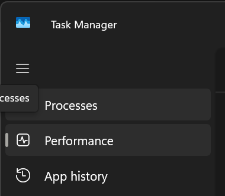
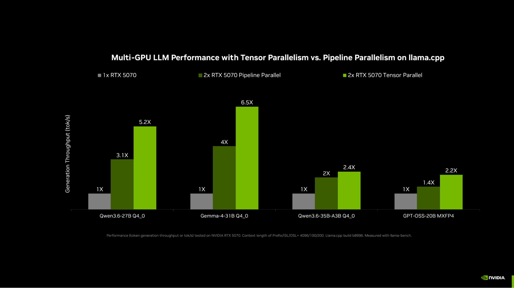
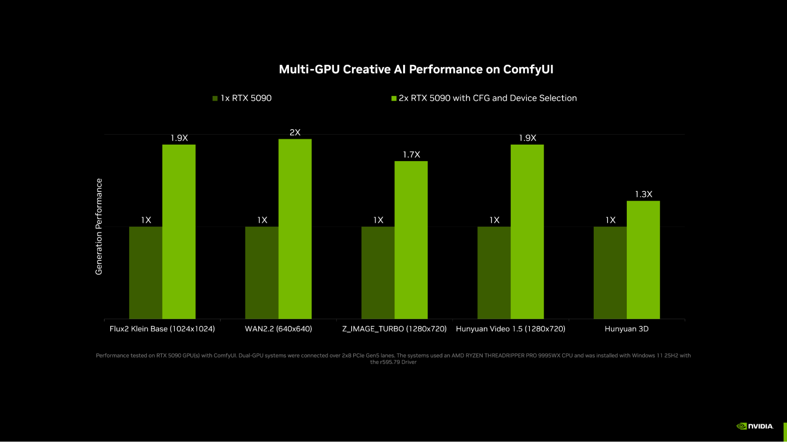
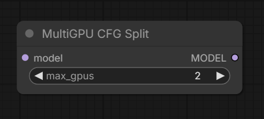
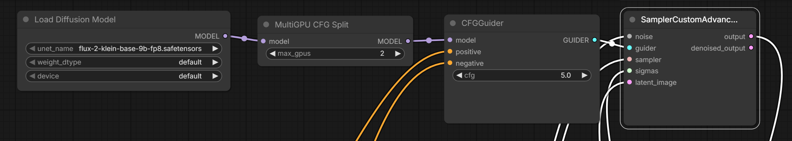
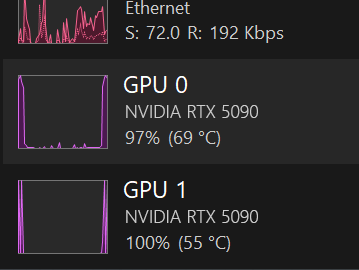

# Build a Multi-GPU AI PC

> Homogeneous dual-GPU setups for Llama.cpp tensor parallel and ComfyUI multi-GPU diffusion


## Table of Contents

- [Overview](#overview)
- [Instructions](#instructions)
  - [LM Studio](#lm-studio)
  - [Llama.cpp CLI / server](#llamacpp-cli-server)
  - [Verify multi-GPU utilization](#verify-multi-gpu-utilization)
- [Troubleshooting](#troubleshooting)

---

## Overview

## Basic idea

Large local models need more memory and compute than a single GPU often provides. A **multi-GPU hardware platform** — two matching discrete GPUs in one system — lets you pool VRAM and accelerate inference and diffusion by splitting work across both cards.

NVIDIA has partnered with the [llama.cpp](https://github.com/ggml-org/llama.cpp) and [ComfyUI](https://www.comfy.org/) communities so consumer-friendly tools can use both GPUs effectively:

- **Llama.cpp tensor parallel** spreads a model across two GPUs for compute and memory — up to ~2× memory capacity and up to ~1.8× compute versus single-GPU, and substantially faster than pipeline parallel for many workloads.
- **ComfyUI MultiGPU CFG Split** runs diffusion CFG work across identical GPUs (and can place pipeline stages per GPU), with measured speedups up to ~2× depending on model and workflow.

This playbook covers configuring those apps on an existing dual-GPU system and, if you are still building, choosing components for a homogeneous dual-GPU PC.

## What you'll accomplish

You'll **configure Llama.cpp / LM Studio and ComfyUI to use two identical GPUs** on your hardware platform, and optionally follow a component guide for assembling a dual-GPU PC.

- Enable **tensor parallel** (or pipeline parallel) for LLMs in LM Studio or llama.cpp
- Insert the **MultiGPU CFG Split** node in ComfyUI and verify both GPUs are active
- Use a **quick spec reference** and component guidance when building or upgrading a dual-GPU system

## What to know before starting

**Required:**

- Familiarity with installing and running local AI apps (LM Studio, llama.cpp, and/or ComfyUI)
- Two **identical** NVIDIA discrete GPUs (homogeneous pair) in one system, or a plan to build that configuration

**Optional:**

- Experience assembling desktop PCs (motherboard PCIe lanes, PSU cabling, BIOS) if you are building from components
- Basic understanding of VRAM sizing for LLMs and diffusion models

## Supported hardware platforms

Use the matrix below to confirm your hardware platform, recommended default local settings, and whether multi-node applies.

| Hardware platform | OS | Memory | Recommended default local settings | Multi-node capable hardware |
| :---- | :---- | :---- | :---- | :---- |
| **RTX or RTX PRO** | Windows 11 (primary); Linux for llama.cpp CLI | Dedicated VRAM (homogeneous dual discrete GPUs) | Tensor parallel (`-sm tensor`) for LLMs; MultiGPU CFG Split for ComfyUI | — |

## Prerequisites

**Hardware requirements**

- Supported hardware platform — see Supported hardware platforms matrix above
- Two identical NVIDIA Ampere-or-newer discrete GPUs (for example, two matching RTX 30 / 40 / 50 Series or matching professional counterparts). Mixed GPU types are not supported
- For best multi-GPU bandwidth: both GPUs on PCIe Gen 5 with at least **x8/x8** lane allocation (x16/x16 preferred when available)
- Sufficient system power and cooling for two GPUs (see the build reference in **Instructions**)

**Software requirements**

- Current NVIDIA GPU driver with both GPUs visible (`nvidia-smi`, or Task Manager → Performance on Windows)
- For LLMs: [LM Studio](https://lmstudio.ai/) with a CUDA runtime, **or** a recent [llama.cpp](https://github.com/ggml-org/llama.cpp/releases/) build (`llama-cli` / `llama-server`)
- For creative AI: [ComfyUI](https://www.comfy.org/) with the MultiGPU CFG Split node available in your install
- Network access to download models and app updates as needed

## Ancillary files

Playbook images live under `assets/` in this repository:

- `assets/llamacpp-tensor-vs-pipeline-performance.png` — Relative llama.cpp throughput: single GPU vs pipeline parallel vs tensor parallel
- `assets/comfyui-multi-gpu-performance.png` — Relative ComfyUI generation performance on one vs two GPUs
- `assets/comfyui-multigpu-cfg-split-node.png` — MultiGPU CFG Split node (`max_gpus`)
- `assets/comfyui-multigpu-workflow-placement.png` — Example placement between model load and sampling
- `assets/task-manager-performance.png` — Windows Task Manager → Performance
- `assets/task-manager-dual-gpu-utilization.png` — Example dual-GPU utilization while a workflow runs

External references:

- [llama.cpp multi-GPU documentation](https://github.com/ggml-org/llama.cpp/blob/master/docs/multi-gpu.md)
- [llama.cpp releases](https://github.com/ggml-org/llama.cpp/releases/)

## Time & risk

- **Estimated time:** 13 MIN for app configuration on an existing dual-GPU system (longer if you are assembling a new PC)
- **Risk level:** Medium
  - Incorrect PCIe lane allocation or a second NVMe drive can silently drop a GPU slot to x4 and hurt multi-GPU performance
  - Undersized or daisy-chained GPU power cables can cause instability or connector damage under load
  - Tensor parallel does not yet support automatic parameter fitting in llama.cpp — OOM requires manual tuning
- **Rollback:** Revert LM Studio split strategy / llama.cpp `-sm` flags, or remove the MultiGPU CFG Split node from ComfyUI workflows. Hardware changes (second GPU, PSU, motherboard) are physical and should be reversed carefully if needed
- **Last Updated:** 08/03/2026
  - Dual-GPU configuration for Llama.cpp / LM Studio and ComfyUI, plus a dual-GPU PC component reference, on supported RTX / RTX PRO hardware platforms

## Instructions

## Step 1. Confirm a homogeneous dual-GPU system

Both GPUs must be the **same model**. Mixed GPU types are not supported for the multi-GPU paths in this playbook. Any NVIDIA Ampere GPU (for example, RTX 30 Series) or newer can be used when the pair matches. For the best experience, connect both GPUs over a high-bandwidth PCIe fabric (ideally Gen 5 with at least x8/x8).

Verify both GPUs are visible:

```bash
nvidia-smi -L
```

On Windows, open **Task Manager → Performance** and confirm two GPU entries appear.



If you already have two matching GPUs installed, continue with Steps 2–3. If you are still choosing components, skip ahead to **Step 4** and return here after the system is built.

## Step 2. Configure Llama.cpp / LM Studio for multi-GPU LLMs



### LM Studio

1. Under **Runtime Settings** (`Ctrl+Shift+R`), ensure a **CUDA** runtime is selected.
2. Open **Hardware Settings** (`Ctrl+Shift+H`) and set the split strategy dropdown to **tensor parallelism**.

### Llama.cpp CLI / server

1. Download the latest build from the [llama.cpp GitHub releases page](https://github.com/ggml-org/llama.cpp/releases/).
2. Run `llama-cli` or `llama-server` with one of the following split modes.

**Pipeline parallel** (shares VRAM across GPUs; less dual-compute benefit):

```bash
<app> -m <model_path> -sm layer -fa 1
```

**Tensor parallel** (preferred — uses both GPUs for compute):

```bash
<app> -m <model_path> -sm tensor -fa 1
```

Replace `<app>` with `llama-cli` or `llama-server`, and `<model_path>` with your model file path.

3. Automatic parameter fitting is not supported with `-sm tensor` yet. If you hit out-of-memory errors, reduce `-np` for `llama-server`, or reduce `-c` or `-ngl`.
4. For more detail, see the [llama.cpp multi-GPU documentation](https://github.com/ggml-org/llama.cpp/blob/master/docs/multi-gpu.md).

## Step 3. Configure ComfyUI MultiGPU CFG Split



The **MultiGPU CFG Split** node lets diffusion processing use multiple identical GPUs in the same system. Speedups are workflow-dependent; up to about **1.95×** has been measured on common workflows.

**Supported models (tested):** LTX-2.3, WAN 2.2, FLUX.2 Klein (base versions), Z-Image, Stable Diffusion 3.5 Large, Hunyuan Video, Qwen-Image-Edit-2511, Hunyuan-3D-v2.1, SDXL.

1. Add the **MultiGPU CFG Split** node and set **`max_gpus`** to the number of identical GPUs installed (for example, `2`).



2. Place the node **between the Model Load node and the Sampling node**. If other nodes connect to the model loader output, MultiGPU CFG Split should be the **last** node in that chain before sampling.



3. Set workflow **CFG greater than 1**. Distilled or similar workflows that require CFG = 1 will not benefit from MultiGPU CFG Split.

### Verify multi-GPU utilization

While the sampler runs with MultiGPU CFG Split enabled, open Windows **Task Manager → Performance**. You should see activity on both installed GPUs.



## Step 4. (Optional) Dual-GPU PC quick spec reference

Use this table if you are building or upgrading a dual-GPU system. Detailed reasoning is in **Step 5**.

| Component | Good | Best |
| :---- | :---- | :---- |
| **GPU 1** | NVIDIA GeForce RTX 5080 | NVIDIA GeForce RTX 5090 |
| **GPU 2** | NVIDIA GeForce RTX 5080 | NVIDIA GeForce RTX 5090 |
| **Motherboard** | x8/x8 PCIe Gen 5 | x16/x16 PCIe Gen 5 |
| **CPU** | AMD Ryzen 9 / Intel Core i9 | AMD Threadripper |
| **RAM** | 64 GB | 128 GB |
| **Storage** | Single PCIe Gen 5 NVMe (4 TB+) | Single PCIe Gen 5 NVMe (4 TB+) |
| **Power supply** | 1600 W+, 80 Plus Gold | 1800 W+, 80 Plus Gold |
| **Case** | Large ATX or open-frame ATX | Large ATX or open-frame ATX |

## Step 5. (Optional) Choosing components

Each subsection covers shared technical context, then recommendations. This is a **component reference** for choosing parts — not a full chassis assembly recipe (torque sequences, cable routing diagrams, or step-by-step physical install photos are out of scope).

#### GPUs

Large language models load weights into GPU memory and stay there while running. Assuming 4-bit quantization, a ~30B model needs at least ~24 GB VRAM; ~70B needs ~40 GB or more; ~120B needs roughly ~70 GB once context is included. Diffusion image and video models behave the same way.

NVIDIA GeForce RTX 50 Series GPUs ship with high-speed GDDR7 and add native FP4 support. FP4 quantization shrinks models by roughly 60–70% while keeping quality near the original. RTX 40 Series GPUs support FP8 quantization with similar size reductions at slightly lower compression.

GPUs must match. Local LLM inference runs at the speed of the slower GPU, and FP4 acceleration applies on RTX 50 Series. Two RTX 5090 GPUs deliver the most VRAM (64 GB combined) and compute. Two RTX 5080 GPUs deliver 32 GB combined at lower power draw per GPU.

#### Motherboard

The motherboard decides how fast the two GPUs can talk. PCIe Gen 5 roughly doubles Gen 4 bandwidth (~4 GB/s per lane) — useful headroom when moving large model weights between GPUs. Prefer at least **x8 PCIe Gen 5** per GPU; less can bottleneck some models. Many consumer boards have one true multi-GPU-capable slot layout — check the manual for which secondary slot is wired for x8 (not x1/x4). Bandwidth is often shared with M.2 NVMe drives; adding a second SSD can silently drop a GPU slot to x4.

**x8/x8 PCIe Gen 5** is a strong target; **x16/x16 PCIe Gen 5** is best when both GPUs run heavy AI work simultaneously.

**Example motherboards (AMD):** ASUS ROG Crosshair X870E Extreme; ASUS ROG Crosshair X870E APEX; ASUS ROG Crosshair X870E Hero; ASUS ProArt X870E-Creator WiFi; Gigabyte X870E Aorus Master X3D Ice; Gigabyte X870E Aorus Xtreme AI TOP; MSI MEG X870E Godlike.

**Example motherboards (Intel):** ASUS ROG Maximus Z890 Extreme; ASUS ROG Maximus Z890 Apex; ASUS ProArt Z890-Creator WiFi; Gigabyte Z890 Aorus Xtreme AI TOP; Gigabyte Z890 Aorus Master AI TOP; Gigabyte Z890 Aorus Tachyon Ice; Gigabyte Z890 Aero D/G; MSI MEG Z890 Godlike; MSI MEG Z890 Ace; MSI MEG Z890 Unify X; MSI MEG Z890 Carbon WiFi.

#### CPU

The CPU provides the PCIe lanes both GPUs depend on. Look for at least **20 PCIe lanes** — enough for two GPUs and one NVMe SSD with dedicated bandwidth. AMD Ryzen 9 or Intel Core i9 is a practical minimum. AMD Threadripper is the best option for full x16/x16 GPU operation plus additional NVMe drives and core count for parallel AI work.

#### RAM

System RAM stages models and activation tensors. **32 GB** is the floor for any multi-GPU build. **64 GB** minimum for typical use; **128 GB** for ~100B-parameter LLMs or fine-tuning workloads (tensor-parallel inference and FSDP2-style fine-tuning stage large tensors through system memory).

#### Storage

A single PCIe Gen 5 NVMe SSD handles most AI workloads. RAID across multiple NVMe drives does not meaningfully help AI load patterns, and extra M.2 drives can steal PCIe lanes from a GPU slot. Prefer one high-capacity drive (**4 TB+**). Quantized 70B and 120B LLMs often occupy 40–80 GB each on disk.

#### Power supply

A single RTX 5090 can draw up to ~575 W under load. Use a CEM 5.1–compliant PSU, and give **each GPU a dedicated 12V-2x6 cable** — do not splice or daisy-chain across GPUs. Size up rather than running near 100% load.

**1600 W** minimum for two RTX 5090s plus a high-end desktop CPU; **1800 W** recommended for headroom. Paired RTX 5080s typically need about **1200–1400 W**. Prefer **80 Plus Gold** or better.

#### Case and cooling

Two GPUs roughly double heat output. Use a full-tower ATX or open-frame ATX chassis with clear airflow between cards. Example cases include Corsair 7000 and 9000 series, NZXT H9 Flow, Phanteks Enthoo Pro, and Thermaltake AX700 series. Air-cooled dual high-power GPUs stacked tightly can starve the lower card of intake — prioritize spacing and airflow.

## Step 6. (Optional) Build tips and common pitfalls

- Seat each **12V-2x6** power cable fully into the GPU **before** installing the card in the motherboard slot. Connecting power after the card is mounted often leaves the connector partially seated.
- Leave at least **~35 mm of slack** on each GPU power cable. Tight bends fatigue the connector and can overheat contacts.
- **Update the motherboard BIOS** before first boot. A stale BIOS often shows up as one GPU not being detected.
- After building, **verify PCIe lane allocation in BIOS**. Adding a second M.2 NVMe can silently drop a GPU slot from x8 to x4.
- Route cables behind the motherboard tray so they do not block airflow between GPUs.
- Power **both GPUs from the same PSU**. Splitting GPU power across two PSUs can create ground-loop and timing issues.

## Step 7. Cleanup (optional)

No software services are installed by this playbook beyond your existing LM Studio, llama.cpp, or ComfyUI setup.

- To stop using multi-GPU in LM Studio: set the hardware split strategy back to your previous single-GPU mode.
- To stop using multi-GPU in llama.cpp: omit `-sm tensor` / `-sm layer` or return to your prior launch flags.
- To stop using multi-GPU in ComfyUI: remove or bypass the MultiGPU CFG Split node in the workflow.

## Troubleshooting

| Symptom | Cause | Fix |
|---------|-------|-----|
| Only one GPU visible in `nvidia-smi` or Task Manager | Second GPU not seated, not powered, disabled in BIOS, or PCIe slot not enabled | Reseat the card and 12V-2x6 cable; confirm the slot is enabled; update BIOS; verify lane allocation |
| Multi-GPU much slower than expected | GPU slot dropped to x4 (often after adding a second M.2 NVMe); mismatched GPUs; pipeline parallel instead of tensor parallel | Check BIOS PCIe status; use identical GPUs; prefer `-sm tensor` / LM Studio tensor parallelism |
| llama.cpp OOM with `-sm tensor` | Automatic parameter fitting not supported for tensor parallel yet | Reduce `-np` (llama-server), or lower `-c` / `-ngl`; see [multi-GPU docs](https://github.com/ggml-org/llama.cpp/blob/master/docs/multi-gpu.md) |
| ComfyUI shows little or no multi-GPU speedup | CFG = 1 (distilled / no-CFG workflows); node placed incorrectly; `max_gpus` too low | Use CFG > 1; place MultiGPU CFG Split last before sampling; set `max_gpus` to the number of identical GPUs |
| Only one GPU active while ComfyUI samples | MultiGPU CFG Split missing or not in the model→sampler path | Insert the node between model load and sampling; confirm both GPUs show activity in Task Manager → Performance |
| Instability, thermal events, or connector damage under load | Partially seated or daisy-chained 12V-2x6 cables; PSU undersized; tight cable bends | Use dedicated CEM 5.1 cables per GPU from one PSU; seat cables before mounting cards; leave cable slack; size PSU with headroom |
| Second GPU not detected after build | Stale motherboard BIOS; incorrect slot used for the second GPU | Update BIOS; move the second GPU to a documented multi-GPU (x8+) slot per the board manual |

> [!NOTE]
> On discrete-GPU hardware platforms, GPU memory is separate from system RAM. CUDA out-of-memory usually means the workload exceeds combined multi-GPU VRAM or per-GPU placement: reduce context length, batch size, or model precision; close other GPU applications; use `nvidia-smi` to confirm no other process is holding memory.

For latest known issues, see the documentation linked under **Resources** for your hardware platform.
