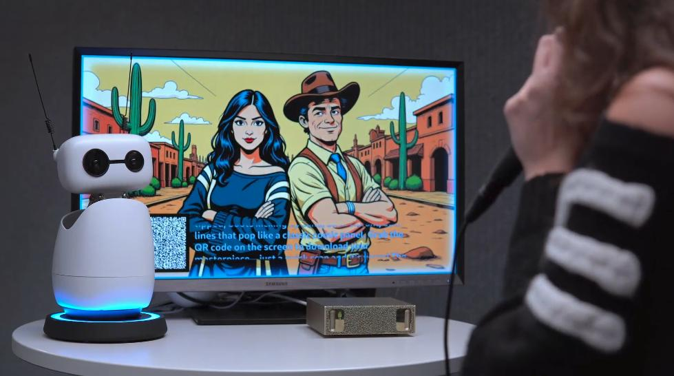
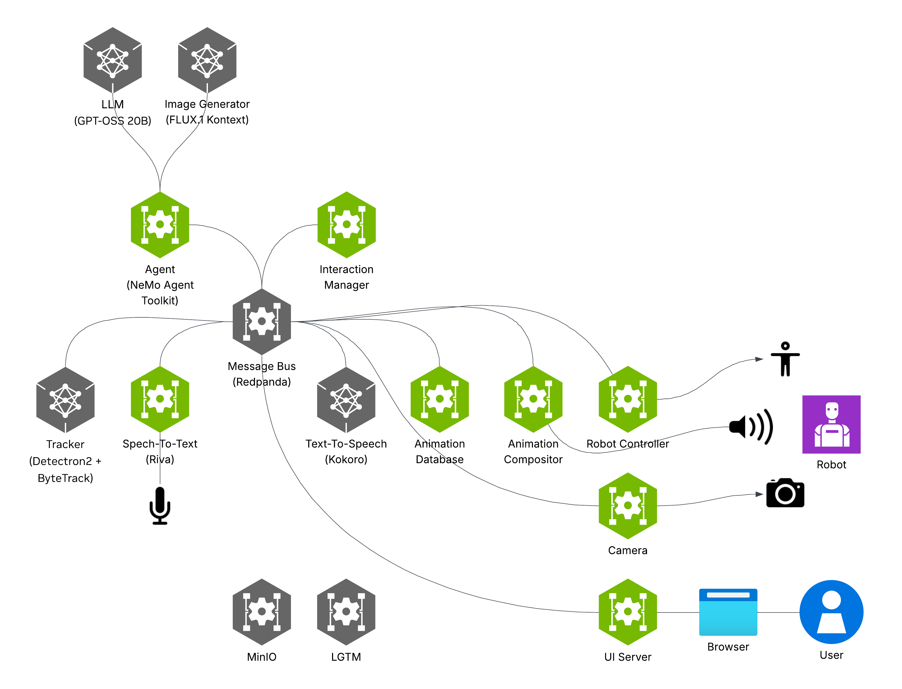
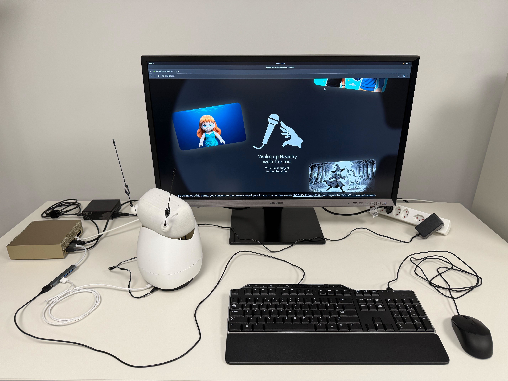

# Build an AI Photo Booth with Reachy and DGX Spark

> Voice, vision, and image generation in a local multimodal stack

## Table of Contents

- [Overview](#overview)
- [Instructions](#instructions)
  - [Guides](#guides)
  - [Service configuration](#service-configuration)
- [Development](#development)
  - [Customize configuration parameters](#customize-configuration-parameters)
  - [Extend the demo with new tools](#extend-the-demo-with-new-tools)
  - [Create your own service](#create-your-own-service)
- [Troubleshooting](#troubleshooting)

---

## Overview

## Basic idea



This playbook deploys an interactive, event-driven photo booth that pairs a **Reachy Mini** robot with your **hardware platform** for a local multimodal AI experience. The system showcases:

- **A multi-modal agent** built with the NeMo Agent Toolkit
- **A ReAct loop** driven by the `openai/gpt-oss-20b` LLM powered by TensorRT-LLM
- **Voice interaction** based on `nvidia/riva-parakeet-ctc-1.1B` and `hexgrad/Kokoro-82M`
- **Image generation** with `black-forest-labs/FLUX.1-Kontext-dev` for image-to-image restyling
- **User position tracking** built with `facebookresearch/detectron2` and `FoundationVision/ByteTrack`
- **MinIO** for storing captured and generated images and sharing them via QR code

The demo is based on several services that communicate through a message bus.



## What you'll accomplish

You'll deploy a complete photo booth system on your **hardware platform** running multiple inference models locally — LLM, image generation, speech recognition, speech generation, and computer vision — without cloud dependencies. Reachy interacts with users through natural conversation, captures photos, and generates custom images based on prompts, demonstrating real-time multimodal AI processing on edge hardware.

## What to know before starting

**Required:**

- Basic Docker and Docker Compose knowledge
- Basic network configuration skills

**Optional:**

- Familiarity with multimodal agents, speech pipelines, or robot peripherals

## Supported hardware platforms

Use the matrix below to confirm your hardware platform, recommended default local settings, and whether multi-node applies.

| Hardware platform | OS | Memory | Recommended default local settings | Multi-node capable hardware |
| :---- | :---- | :---- | :---- | :---- |
| **DGX Spark** | DGX OS (Linux) | 128 GB Unified Memory | Docker Compose stack from [spark-reachy-photo-booth](https://github.com/NVIDIA/spark-reachy-photo-booth); gpt-oss-20b + FLUX.1-Kontext + Parakeet ASR | — |

## Prerequisites

**Hardware requirements**

- Supported hardware platform — see Supported hardware platforms matrix above
- A monitor, keyboard, and mouse to run this playbook directly on the hardware platform
- [Reachy Mini Lite robot](https://pollen-robotics-reachy-mini.hf.space/)

> [!TIP]
> Make sure your Reachy Mini robot firmware is up to date. You can find update instructions [here](https://huggingface.co/spaces/pollen-robotics/Reachy_Mini).

**Software requirements**

- Official [DGX OS](https://docs.nvidia.com/dgx/dgx-spark/dgx-os.html) image including Git, Docker, NVIDIA drivers, and the NVIDIA Container Toolkit
- An internet connection for the hardware platform
- NVIDIA NGC Personal API Key (`NVIDIA_API_KEY`). [Create a key](https://org.ngc.nvidia.com/setup/api-keys) if necessary. Enable the `NGC Catalog` scope when creating the key.
- Hugging Face access token (`HF_TOKEN`). [Create a token](https://huggingface.co/settings/tokens) if necessary. Use a token with _Read access to contents of all public gated repos you can access_.
- To access FLUX.1-Kontext-dev, review and accept the [FLUX.1-Kontext-dev](https://huggingface.co/black-forest-labs/FLUX.1-Kontext-dev) and [FLUX.1-Kontext-dev-onnx](https://huggingface.co/black-forest-labs/FLUX.1-Kontext-dev-onnx) License Agreements and Acceptable Use Policy.

## Ancillary files

Application source, Compose files, and service configuration live in the [Reachy Photo Booth repository](https://github.com/NVIDIA/spark-reachy-photo-booth). Local playbook assets:

- `assets/teaser.jpg` — Teaser image shown above
- `assets/architecture-diagram.png` — Architecture diagram shown above
- `assets/setup.jpg` — Hardware setup reference used in Instructions

## Time & risk

- **Estimated time:** 2 HOURS including hardware setup, container builds, and model downloads
- **Risk level:** Medium
  - First-run container builds and model downloads can take 30 minutes to 2 hours depending on network speed
  - Robot audio and USB device conflicts can block the demo until devices are freed
  - Gated Hugging Face models require accepted licenses and a correctly scoped token
- **Rollback:** Stop and remove Docker containers to free resources. Delete downloaded models from cache directories if needed. Disconnect the robot and peripherals safely. Revert custom network settings used for QR-code sharing.
- **Last Updated:** 08/03/2026
  - Local Reachy photo booth with multimodal agent, voice, vision, and image generation on supported hardware platforms

## Instructions

## Step 1. Clone the repo

To manage containers without `sudo`, you must be in the `docker` group. If you skip this step, run Docker commands with `sudo`.

Open a terminal and test Docker access:

```bash
docker ps
```

If you see a permission denied error (for example, permission denied while trying to connect to the Docker daemon socket), add your user to the docker group:

```bash
sudo usermod -aG docker $USER
newgrp docker
```

```bash
git clone https://github.com/NVIDIA/spark-reachy-photo-booth.git
cd spark-reachy-photo-booth
```

> [!WARNING]
> Run this playbook directly on your hardware platform with a local web browser. Remote-only access without a display session is not the primary path.

## Step 2. Create your environment

```bash
cp .env.example .env
```

Edit `.env` and set:

- **`NVIDIA_API_KEY`**: your NVIDIA API key (must start with `nvapi-...`)
- **`HF_TOKEN`**: your Hugging Face token (must start with `hf_...`)
- **`EXTERNAL_MINIO_BASE_URL`**: leave unchanged unless you follow **Step 6** (QR-code sharing on your local network)

To access the FLUX.1-Kontext-dev model, sign in to Hugging Face, then review and accept the [FLUX.1-Kontext-dev](https://huggingface.co/black-forest-labs/FLUX.1-Kontext-dev) and [FLUX.1-Kontext-dev-onnx](https://huggingface.co/black-forest-labs/FLUX.1-Kontext-dev-onnx) License Agreements and Acceptable Use Policy.

The remaining values use reasonable defaults for local development (MinIO). For production or untrusted environments, change these values and store them securely.

## Step 3. Set up Reachy Mini

- Plug the power cable into the base of Reachy Mini and into a power outlet.
- Plug a USB-C cable from the base of Reachy Mini into your hardware platform.
- Engage the power switch at the base of Reachy Mini. The LED next to the switch should turn red.

Verify that the robot is detected:

```bash
lsusb | grep Reachy
```

You should see a device similar to `Bus 003 Device 003: ID 38fb:1001 Pollen Robotics Reachy Mini Audio`.

Run the following command so the Reachy Mini speaker can reach maximum volume:

```bash
./robot-controller-service/scripts/speaker_setup.sh
```



## Step 4. Start the stack

Sign in to the nvcr.io registry:

```bash
docker login nvcr.io -u "\$oauthtoken"
```

When prompted for a password, enter your NGC personal API key.

```bash
docker compose up --build -d
```

This command pulls and builds container images and downloads required model artifacts. The first run can take between 30 minutes and 2 hours, depending on your internet speed. Subsequent runs usually complete in about 5 minutes.

## Step 5. Open the UI in your browser

On your hardware platform, open a web browser and go to the **Web UI**: [http://127.0.0.1:3001](http://127.0.0.1:3001).

> [!TIP]
> The Web UI is available only when all containers are up and running.
> Check container status with `docker compose ps --format "table {{.ID}}\t{{.Names}}\t{{.Status}}"`.
> If one or more containers are failing, inspect logs with `docker compose logs -f <container_name>`.

> [!TIP]
> You can remotely **spectate** the ongoing interaction by opening an SSH session with X11 forwarding (`ssh -X <USER>@<HARDWARE_IP>`), then opening a browser in that session to [http://127.0.0.1:3001](http://127.0.0.1:3001).

> [!NOTE]
> The UI has a small impact on image-generation performance. To optimize image generation, use Chromium instead of Firefox when available, and reduce the display resolution.

## Step 6. Optional: Enable QR-code sharing on your local network

Reachy can take pictures and generate images based on them. The web UI shows generated images with a QR code for download. This section explains how to make that QR code reachable from users' phones.

For QR codes to open on a phone, your hardware platform and phone must be on the same local network. Ensure your router permits device-to-device communication.

#### 1. Find your hardware platform's local IP address

```bash
ip -4 addr show scope global
```

Find the IPv4 address on your LAN (often something like `192.168.x.x` or `10.x.x.x`).

#### 2. Ensure MinIO is reachable from your phone

- **Same network**: connect your phone to the same Wi‑Fi/LAN as the hardware platform.
- **Firewall**: by default, the supported hardware platform does not block incoming requests. If you installed a firewall, allow inbound traffic on **`9010` (MinIO API)**.

#### 3. Update `.env` and restart

Edit `.env` and replace:

- **`EXTERNAL_MINIO_BASE_URL=127.0.0.1:9010`** → **`EXTERNAL_MINIO_BASE_URL=<HARDWARE_LAN_IP>:9010`**

Then restart:

```bash
docker compose down
docker compose up --build -d
```

## Step 7. Optional: Going further and customizing the application

### Guides

- [Getting Started](https://github.com/NVIDIA/spark-reachy-photo-booth/tree/main/docs/getting-started.md) – In-depth setup and configuration walkthrough
- [Writing Your First Service](https://github.com/NVIDIA/spark-reachy-photo-booth/tree/main/docs/writing-your-first-service.md) – How to create and integrate a new service

### Service configuration

Each service has its own README with details on customization, environment variables, and service-specific configuration:

| Service | Description |
|---------|-------------|
| [agent-service](https://github.com/NVIDIA/spark-reachy-photo-booth/tree/main/agent-service/README.md) | LLM-powered agent workflow and decision logic |
| [animation-compositor-service](https://github.com/NVIDIA/spark-reachy-photo-booth/tree/main/animation-compositor-service/README.md) | Combines animation clips and audio mixing |
| [animation-database-service](https://github.com/NVIDIA/spark-reachy-photo-booth/tree/main/animation-database-service/README.md) | Animation library and procedural animation generation |
| [camera-service](https://github.com/NVIDIA/spark-reachy-photo-booth/tree/main/camera-service/README.md) | Camera capture and image acquisition |
| [interaction-manager-service](https://github.com/NVIDIA/spark-reachy-photo-booth/tree/main/interaction-manager-service/README.md) | Event orchestration and robot utterance management |
| [metrics-service](https://github.com/NVIDIA/spark-reachy-photo-booth/tree/main/metrics-service/README.md) | Metrics collection and monitoring |
| [remote-control-service](https://github.com/NVIDIA/spark-reachy-photo-booth/tree/main/remote-control-service/README.md) | Web-based remote control interface |
| [robot-controller-service](https://github.com/NVIDIA/spark-reachy-photo-booth/tree/main/robot-controller-service/README.md) | Direct robot hardware control |
| [speech-to-text-service](https://github.com/NVIDIA/spark-reachy-photo-booth/tree/main/speech-to-text-service/README.md) | Audio transcription (NVIDIA Riva/Parakeet) |
| [text-to-speech-service](https://github.com/NVIDIA/spark-reachy-photo-booth/tree/main/text-to-speech-service/README.md) | Speech synthesis |
| [tracker-service](https://github.com/NVIDIA/spark-reachy-photo-booth/tree/main/tracker-service/README.md) | Person detection and tracking |
| [ui-server-service](https://github.com/NVIDIA/spark-reachy-photo-booth/tree/main/ui-server-service/README.md) | Backend for the web UI |

For detailed guidance on customizing service configurations, extending the demo with new tools, or creating your own services, refer to the **Development** tab.

## Step 8. Optional: Cleanup

When you are finished, stop the stack to free resources. Cleanup is optional rollback — not a required completion step.

> [!WARNING]
> This stops and removes the Compose containers for this project. Downloaded model caches are not deleted unless you remove them separately.

```bash
docker compose down
```

To reclaim model download disk space, delete the relevant Hugging Face / NGC cache directories used by the services after you no longer need them.

## Development

## Development

This section covers customizing and developing on the Reachy Photo Booth application. If you want to deploy and run the application as-is, use the **Instructions** tab instead.

## Step 1. System dependencies

Install the following packages for the Python development setup:

```bash
sudo apt install python3.12-dev portaudio19-dev
```

Install uv by following the instructions [here](https://docs.astral.sh/uv/getting-started/installation/).

Then generate the Python **venv**:

```bash
uv sync --all-packages
```

## Step 2. Get acquainted with the build and development process

Every folder suffixed by `-service` is a standalone Python program that runs in its own container. Always start services through the `docker-compose.yaml` at the repository root. Enable code hot reloading for all Python services with:

```bash
docker compose up --build --watch
```

When you change Python code in the repository, the associated container updates and restarts automatically.

The [Getting Started](https://github.com/NVIDIA/spark-reachy-photo-booth/tree/main/docs/getting-started.md) guide covers the build system, development workflow, debugging strategies, and monitoring infrastructure.

## Step 3. Make changes to the application

With the development environment set up, these are common customizations.

### Customize configuration parameters

Each service has configurable parameters including system prompts, audio devices, model settings, and more. Check the individual service READMEs and the `src/configuration.py` files for options. Defaults in `src/configuration.py` may also be overridden in the `compose.yaml` file. Start with:

- [speech-to-text-service](https://github.com/NVIDIA/spark-reachy-photo-booth/tree/main/speech-to-text-service/README.md) — Configure audio devices and transcription settings
- [text-to-speech-service](https://github.com/NVIDIA/spark-reachy-photo-booth/tree/main/text-to-speech-service/README.md) — Adjust voice synthesis parameters
- [agent-service](https://github.com/NVIDIA/spark-reachy-photo-booth/tree/main/agent-service/README.md) — Customize LLM system prompts, agent behavior, and decision logic

See the **Instructions** tab for a complete list of services and their READMEs.

### Extend the demo with new tools

The agent-service and interaction-manager-service are the core services for extending the demo:

- [agent-service](https://github.com/NVIDIA/spark-reachy-photo-booth/tree/main/agent-service/README.md) — Add new agent tools and capabilities
- [interaction-manager-service](https://github.com/NVIDIA/spark-reachy-photo-booth/tree/main/interaction-manager-service/README.md) — Manage event orchestration and robot utterances

### Create your own service

The [Writing Your First Service](https://github.com/NVIDIA/spark-reachy-photo-booth/tree/main/docs/writing-your-first-service.md) guide provides a step-by-step tutorial on scaffolding, implementing, and integrating a new microservice into the system.

## Troubleshooting

| Symptom | Cause | Fix |
|---------|-------|-----|
| No audio from robot (low volume) | Reachy speaker volume set too low by default | Run `./robot-controller-service/scripts/speaker_setup.sh` and increase Reachy speaker volume to maximum |
| No audio from robot (device conflict) | Another application capturing the Reachy speaker | Check `animation-compositor` logs for `Error querying device (-1)`, verify Reachy speaker is not set as the system default in sound settings, ensure no other apps are capturing the speaker, then restart the demo |
| Web UI unavailable at `http://127.0.0.1:3001` | One or more containers not healthy | Run `docker compose ps` and `docker compose logs -f <container_name>`; wait for first-run model downloads to finish |
| QR code download fails on phone | Phone cannot reach MinIO on the hardware platform | Confirm same LAN, allow inbound port `9010` if a firewall is enabled, and set `EXTERNAL_MINIO_BASE_URL=<HARDWARE_LAN_IP>:9010` then restart Compose |
| Memory pressure / stalls with free capacity remaining | Unified memory buffer cache pressure | Flush the buffer cache (note below) |

> [!NOTE]
> Some hardware platforms use Unified Memory Architecture (UMA), which enables dynamic memory sharing between the GPU and CPU. If you hit memory pressure even when within rated capacity, manually flush the buffer cache with:
> ```bash
> sudo sh -c 'sync; echo 3 > /proc/sys/vm/drop_caches'
> ```

For latest known issues, see the documentation linked under **Resources** for your hardware platform.
