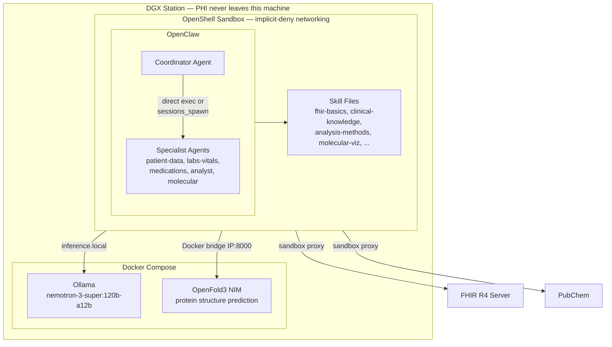

# Architecture

How the clinical intelligence system works — from FHIR queries to protein structure prediction, inside an OpenShell sandbox.

---

## System Overview

The user types a clinical question in plain English. The coordinator reads its skills, writes Python scripts to query FHIR, analyze data, and generate visualizations. For molecular targets, it calls PubChem for drug SMILES and OpenFold3 for protein structure prediction.

---

## Network Policy

The sandbox enforces **implicit-deny networking**. Only whitelisted endpoints are reachable:

| Rule | Target | Purpose |
|------|--------|---------|
| LLM inference | `inference.local:443` | Routed to Ollama via OpenShell privacy router |
| FHIR data | `r4.smarthealthit.org:443` | Patient data queries (read-only) |
| PubChem | `pubchem.ncbi.nlm.nih.gov:443` | Drug name → SMILES resolution (read-only) |
| OpenFold3 | `<docker-bridge-ip>:8000` | Protein structure prediction |
| CDN | `code.jquery.com`, `3Dmol.org` | JS libraries for 3D molecular viewers |
| PyPI | `pypi.org`, `files.pythonhosted.org` | Package install (setup only) |
| Everything else | `*` | **Denied** |

`inference.local` is a virtual hostname. OpenShell's privacy router intercepts the request and forwards directly to Ollama on the host.

---

## Agent Architecture

The coordinator does the work directly by default — writing and executing Python scripts. Delegation to specialist agents is available when explicitly requested.

| Agent | Role |
|-------|------|
| **Coordinator** (`main`) | Receives questions, writes Python, executes analysis, delegates when asked |
| **Patient Data** | Finds patients, retrieves conditions from FHIR |
| **Labs/Vitals** | Retrieves lab results and vital signs, handles BP component observations |
| **Medications** | Retrieves prescriptions, classifies by drug class |
| **Analyst** | Writes validated Python analysis code with charts |
| **Molecular** | Runs `build_viewer.py` for PubChem + OpenFold3 + 3D viewer generation |

---

## Skill Files

Clinical knowledge lives in plain Markdown. The LLM reads these at runtime — no retraining needed.

| Skill | What It Teaches |
|-------|----------------|
| `fhir-basics` | FHIR R4 endpoints, JSON parsing, component Observations (BP), pagination |
| `clinical-knowledge` | Lab reference ranges, SNOMED/LOINC codes, CMS measures, drug classes |
| `analysis-methods` | Python code patterns: FHIR via curl, care gap detection, NVIDIA-themed charts |
| `molecular-viz` | `build_viewer.py` usage, built-in drug-target table, OpenFold3 confidence scores |
| `clinical-delegation` | `sessions_spawn` patterns for multi-agent delegation |
| `case-summary` | Single-patient case compilation |
| `cohort-compare` | Population-level quality gap analysis |

---

## Infrastructure

| Component | How it runs | Port | GPU |
|-----------|------------|------|-----|
| Ollama + nemotron-3-super:120b-a12b | Docker Compose | 11434 | ~94 GB |
| OpenFold3 NIM | Docker Compose | 8000 | ~40-80 GB on-demand |
| OpenShell Gateway | Host (`openshell-gateway` binary) | 17670 | — |
| OpenClaw Gateway | Inside sandbox (`openclaw gateway run`) | 18789 | — |
| **Total peak** | | | **~150 GB / 284 GB** |

---

## PHI Data Flow

| Layer | Contains PHI? | Notes |
|-------|:------------:|-------|
| FHIR server | Yes | Source of truth |
| Sandbox proxy | Encrypted only | Enforces network policy |
| Python execution (in sandbox) | Yes | Ephemeral, displayed in terminal |
| LLM prompt | No | Skill files + user question |
| LLM response | No | Generated Python code |
| OpenFold3 NIM | No | Protein sequences only |
| PubChem | No | Drug name lookups only |

**Key principle:** Patient data flows from FHIR → sandbox → Python execution. It never passes through the LLM, OpenFold3, or PubChem.

---

## Production Considerations

| Component | Demo | Production |
|-----------|------|-----------|
| FHIR endpoint | Public test server (no auth) | Hospital FHIR server (OAuth2 SMART on FHIR) |
| Patient data | Synthetic (Synthea) | Real PHI |
| LLM model | nemotron-3-super:120b-a12b | Same or larger |
| Protein structure | OpenFold3 (torch_baseline) | Same with TRT backend |
| Authentication | None | SSO/LDAP + RBAC |

---

## Known Limitations

1. **No Bulk FHIR.** Production population health requires `$export`.
2. **Simplified CMS measures.** Core logic, not full eCQM specifications.
3. **Representative drug lists.** Requires institutional formulary mapping.
4. **Canvas proxy strips external scripts.** JS must be inlined; `build_viewer.py` handles this.
5. **Synthetic test data.** Unrealistic clinical distributions.

---

Not a regulated medical device. Test data is synthetic (Synthea). All clinical decisions must be made by qualified clinicians.
