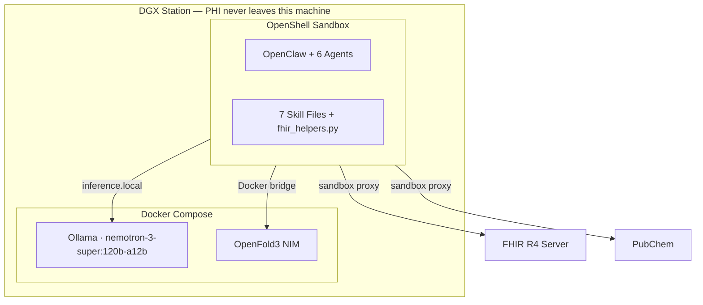

# Local Healthcare Agent

Multi-agent healthcare system that automates quality measure reporting, patient case summaries, population health queries, and molecular visualization — running entirely on-premises inside an OpenShell sandbox so patient data never leaves the machine.

**[Setup Guide →](SETUP-GUIDE.md)** · **[Architecture →](ARCHITECTURE.md)**

---

## Architecture



## Stack

| Component | Purpose |
|-----------|---------|
| DGX Station (284 GB VRAM) | On-prem GPU platform |
| OpenShell | Sandbox orchestration, implicit-deny networking, L7 policy enforcement |
| OpenClaw | Agent framework, tool calling, web UI |
| Ollama + nemotron-3-super:120b-a12b | Local LLM inference (120B total, 12B active MoE) |
| OpenFold3 NIM | Protein structure prediction |

## Agents

| Agent | Role |
|-------|------|
| **Coordinator** | Receives questions, writes Python, executes analysis |
| **Patient Data** | Finds patients, retrieves conditions from FHIR |
| **Labs/Vitals** | Retrieves lab results and vital signs |
| **Medications** | Retrieves prescriptions, classifies by drug class |
| **Analyst** | Writes validated Python analysis code |
| **Molecular** | PubChem → OpenFold3 → 3D protein-ligand viewer |

## Quick Start

```bash
git clone https://github.com/jaival-nvidia/local-healthcare-agent.git
cd local-healthcare-agent
cp .env.example .env            # set NGC_API_KEY

make up                         # start Ollama + OpenFold3
make status                     # wait for all healthy

# One-time: start OpenShell gateway + configure provider (see SETUP-GUIDE.md)

make setup                      # create sandbox, deploy everything
make test                       # verify (~1 min)

# SSH tunnel from your laptop:
ssh -f -N -L 18789:localhost:18789 <user>@<dgx-ip>
open http://localhost:18789/
```

See **[SETUP-GUIDE.md](SETUP-GUIDE.md)** for the complete walkthrough.

## Demo Prompts

```
Find all diabetic patients, get their latest A1c and medications.
Identify gap patients with A1c above 9% not on insulin or GLP-1.
Show the A1c distribution as a histogram.
```

```
Show me the 3D protein structure of atorvastatin bound to its target
```


## What's Inside

```
IDENTITY.md                     # Coordinator persona + rules
agents/                         # Specialist agent definitions
  patient-data-agent.md
  labs-vitals-agent.md
  medications-agent.md
  analyst-agent.md
  molecular-agent.md
skills/                         # Clinical knowledge (Markdown)
  fhir-basics/SKILL.md
  clinical-knowledge/SKILL.md
  analysis-methods/
    SKILL.md                    # Code guidelines + helper function reference
    scripts/fhir_helpers.py     # Importable FHIR query library (batched)
  molecular-viz/SKILL.md
  clinical-delegation/SKILL.md
  case-summary/SKILL.md
  cohort-compare/SKILL.md
scripts/
  build_viewer.py               # PubChem + OpenFold3 + 3D viewer
  check_sandbox_config.sh       # Verify sandbox config matches repo
  setup_sandbox.sh              # Automated sandbox setup
  restart_sandbox.sh            # Gateway restart helper
  test-all.sh                   # CLI test suite (L1-L5)
  test-lib.sh                   # Test utilities
docker/
  test/Dockerfile               # Test runner container
docker-compose.yml              # Ollama + OpenFold3
Makefile                        # One-command operations (up, setup, check, test)
sandbox-policy.yaml             # Network policy (L7 enforced, Landlock best_effort)
```

## Network Policy

Implicit-deny. Only these endpoints are reachable from the sandbox:

| Endpoint | Purpose |
|----------|---------|
| `inference.local:443` | LLM via OpenShell privacy router |
| `r4.smarthealthit.org:443` | FHIR patient data (read-only) |
| `pubchem.ncbi.nlm.nih.gov:443` | Drug → SMILES lookup (read-only) |
| `<docker-bridge>:8000` | OpenFold3 NIM |
| `code.jquery.com`, `3Dmol.org` | JS for 3D viewers |

Everything else is blocked. Patient data never leaves the sandbox.

---

Not a regulated medical device. Test data is synthetic (Synthea). All clinical decisions must be made by qualified clinicians.
