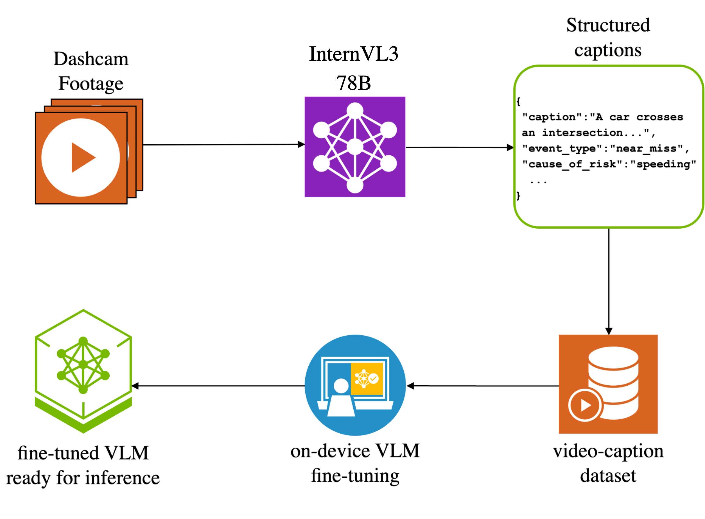
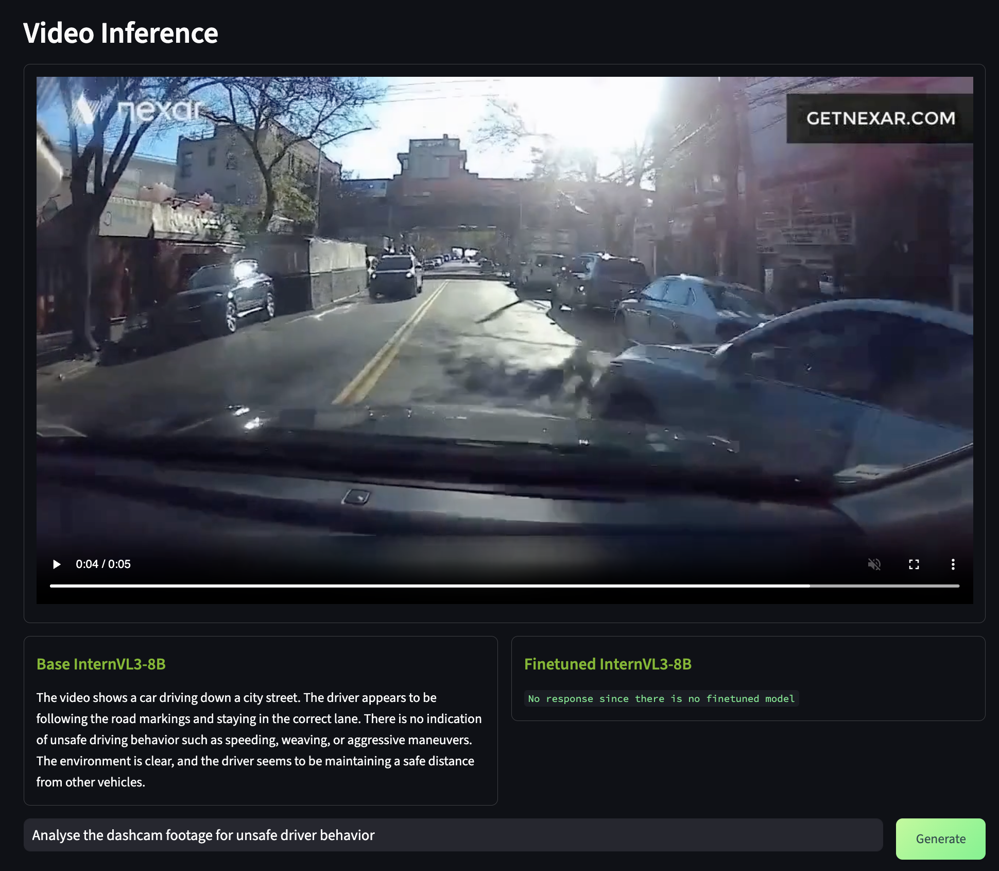

# Video VLM Fine-tuning with InternVL3

This project demonstrates fine-tuning the InternVL3 model for video analysis, specifically for dangerous driving detection and structured metadata generation from driving videos.

## Workflow Overview



### Training Workflow Steps:

1. **🎥 Dashcam Footage**: Dashcam footage from the Nexar Collision Prediction dataset
2. **Generate Structed caption**: Leverage a very large VLM (InternVL3-78B) to generate structured captions from raw videos
3. **🧠 Train InternVL3 Model**: Perform Supervised Finetuning on InternVL3-8B to extract structured metadata
4. **🚀 Fine-tuned VLM**: Trained model ready for analysing driver behaviour and risk factors


## Training

### Data Requirements

Your dataset should be structured as follows:
```
dataset/
├── videos/
│   ├── video1.mp4
│   ├── video2.mp4
│   └── ...
└── metadata.jsonl  # Contains video paths and labels
```

Each line in `metadata.jsonl` should contain:
```json
{
    "video": "videos/video1.mp4",
    "caption": "Description of the video events",
    "event_type": "collision" | "near_miss" | "no_incident",
    "rule_violations": choose relevant items from ["speeding", "failure_to_yield", "ignoring_traffic_signs"],
    "intended_driving_action": "turn_left" | "turn_right" | "change_lanes",
    "traffic_density": "low" | "high",
    "visibility": "good" | "bad"
}
```

### Running Training

1. **Update Dataset Path**: Edit the training notebook to point to your dataset:
   ```python
   dataset_path = "/path/to/your/dataset"
   ```

2. **Run Training Notebook**:
   ```bash
   # Inside the container, navigate to the training directory
   cd ui_video/train
   jupyter notebook video_vlm.ipynb
   ```

3. **Monitor Training**: Training progress and metrics are displayed directly in the notebook interface.

### Training Configuration

Key training parameters configurable:
- **Model**: InternVL3-8B
- **Video Frames**: 12 to 16 frames per video
- **Sampling Mode**: Uniform temporal sampling
- **LoRA Configuration**: Efficient parameter updates for large-scale fine-tuning
- **Hyperparameters**: Exhaustive suite of hyperparameters to tune for video VLM finetuning

## Inference

### Running Inference

1. **Streamlit Web Interface**:
   ```bash
   # Start the interactive web interface
   cd ui_video
   streamlit run Video_VLM.py
   ```
   
   The interface provides:
   - Dashcam video gallery and playback
   - Side-by-side comparison between base and finetuned model
   - JSON output generation
   - Tabular view of structured data extracted for analysis

2. **Configuration**: Edit `src/video_vlm_config.yaml` to modify model settings, frame count, and sampling strategy.

### Sample Output

The model generates structured JSON output like:
```json
{
    "caption": "A vehicle makes a dangerous lane change without signaling while speeding on a highway during daytime with clear weather conditions.",
    "event_type": "near_miss",
    "cause_of_risk": ["speeding", "risky_maneuver"],
    "presence_of_rule_violations": ["failure_to_use_turn_signals"],
    "intended_driving_action": ["change_lanes"],
    "traffic_density": "medium",
    "driving_setting": ["highway"],
    "time_of_day": "day",
    "light_conditions": "normal",
    "weather": "clear",
    "scene": "highway"
}
```

Inference Screenshot



## File Structure

```
ui_video/
├── README.md                 # This file
├── Video_VLM.py             # Streamlit web interface for inference
├── src/
│   ├── styles.css           # CSS styling for Streamlit app
│   └── video_vlm_config.yaml # Model and inference configuration
├── train/
│   └── video_vlm.ipynb      # Jupyter notebook for model training
└── assets/
    └── video_vlm/
        ├── videos/          # Sample video files
        └── thumbnails/      # Video thumbnail previews

# Root directory also contains:
├── Dockerfile               # Multi-stage Docker build with FFmpeg/Decord
└── launch.sh               # Docker launch script
```

## Model Capabilities

The fine-tuned InternVL3 model can:
- **Video Analysis**: Process multi-frame dashcam footage for comprehensive scene understanding
- **Safety Detection**: Identify dangerous driving patterns, near-misses, and traffic violations
- **Structured Output**: Generate JSON metadata with standardized driving scene categories
